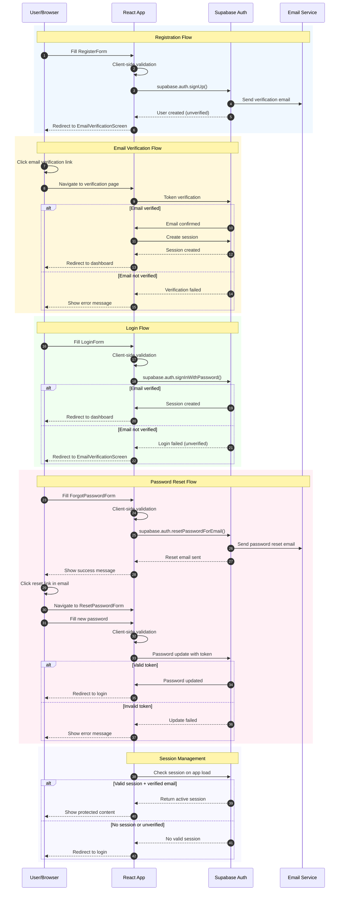

```mermaid
sequenceDiagram
    autonumber

    participant User/Browser
    participant React App
    participant Supabase Auth
    participant Email Service

    %% Registration Flow
    rect rgb(240, 248, 255)
        Note over User/Browser,Email Service: Registration Flow
        User/Browser->>React App: Fill RegisterForm
        React App->>React App: Client-side validation
        React App->>Supabase Auth: supabase.auth.signUp()
        Supabase Auth->>Email Service: Send verification email
        Supabase Auth-->>React App: User created (unverified)
        React App-->>User/Browser: Redirect to EmailVerificationScreen
    end

    %% Email Verification Flow
    rect rgb(255, 248, 220)
        Note over User/Browser,Supabase Auth: Email Verification Flow
        User/Browser->>User/Browser: Click email verification link
        User/Browser->>React App: Navigate to verification page
        React App->>Supabase Auth: Token verification
        alt Email verified
            Supabase Auth->>React App: Email confirmed
            React App->>Supabase Auth: Create session
            Supabase Auth-->>React App: Session created
            React App-->>User/Browser: Redirect to dashboard
        else Email not verified
            Supabase Auth-->>React App: Verification failed
            React App-->>User/Browser: Show error message
        end
    end

    %% Login Flow
    rect rgb(240, 255, 240)
        Note over User/Browser,Supabase Auth: Login Flow
        User/Browser->>React App: Fill LoginForm
        React App->>React App: Client-side validation
        React App->>Supabase Auth: supabase.auth.signInWithPassword()
        alt Email verified
            Supabase Auth->>React App: Session created
            React App-->>User/Browser: Redirect to dashboard
        else Email not verified
            Supabase Auth-->>React App: Login failed (unverified)
            React App-->>User/Browser: Redirect to EmailVerificationScreen
        end
    end

    %% Password Reset Flow
    rect rgb(255, 240, 245)
        Note over User/Browser,Email Service: Password Reset Flow
        User/Browser->>React App: Fill ForgotPasswordForm
        React App->>React App: Client-side validation
        React App->>Supabase Auth: supabase.auth.resetPasswordForEmail()
        Supabase Auth->>Email Service: Send password reset email
        Supabase Auth-->>React App: Reset email sent
        React App-->>User/Browser: Show success message

        User/Browser->>User/Browser: Click reset link in email
        User/Browser->>React App: Navigate to ResetPasswordForm
        User/Browser->>React App: Fill new password
        React App->>React App: Client-side validation
        React App->>Supabase Auth: Password update with token
        alt Valid token
            Supabase Auth->>React App: Password updated
            React App-->>User/Browser: Redirect to login
        else Invalid token
            Supabase Auth-->>React App: Update failed
            React App-->>User/Browser: Show error message
        end
    end

    %% Session Management
    rect rgb(248, 248, 255)
        Note over React App,Supabase Auth: Session Management
        React App->>Supabase Auth: Check session on app load
        alt Valid session + verified email
            Supabase Auth-->>React App: Return active session
            React App-->>User/Browser: Show protected content
        else No session or unverified
            Supabase Auth-->>React App: No valid session
            React App-->>User/Browser: Redirect to login
        end
    end
```
