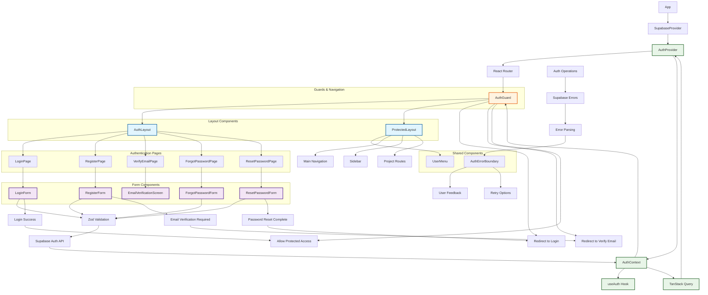

```mermaid
flowchart TD
    %% Application Root and Providers
    App["App"] --> SupabaseProvider["SupabaseProvider"]
    SupabaseProvider --> AuthProvider["AuthProvider"]
    AuthProvider --> Router["React Router"]

    %% Authentication State Management
    AuthProvider --> AuthContext["AuthContext"]
    AuthContext --> useAuth["useAuth Hook"]
    AuthContext --> AuthGuard["AuthGuard"]

    %% Layout Components
    subgraph "Layout Components"
        AuthLayout["AuthLayout"]
        ProtectedLayout["ProtectedLayout"]
    end

    %% Authentication Pages and Forms
    subgraph "Authentication Pages"
        LoginPage["LoginPage"]
        RegisterPage["RegisterPage"]
        VerifyEmailPage["VerifyEmailPage"]
        ForgotPasswordPage["ForgotPasswordPage"]
        ResetPasswordPage["ResetPasswordPage"]
    end

    %% Form Components
    subgraph "Form Components"
        LoginForm["LoginForm"]
        RegisterForm["RegisterForm"]
        ForgotPasswordForm["ForgotPasswordForm"]
        ResetPasswordForm["ResetPasswordForm"]
        EmailVerificationScreen["EmailVerificationScreen"]
    end

    %% Shared Authentication Components
    subgraph "Shared Components"
        UserMenu["UserMenu"]
        AuthErrorBoundary["AuthErrorBoundary"]
    end

    %% Navigation and Guards
    subgraph "Guards & Navigation"
        AuthGuard --> AuthLayout
        AuthGuard --> ProtectedLayout
    end

    %% Page to Layout Relationships
    AuthLayout --> LoginPage
    AuthLayout --> RegisterPage
    AuthLayout --> VerifyEmailPage
    AuthLayout --> ForgotPasswordPage
    AuthLayout --> ResetPasswordPage

    %% Page to Form Relationships
    LoginPage --> LoginForm
    RegisterPage --> RegisterForm
    VerifyEmailPage --> EmailVerificationScreen
    ForgotPasswordPage --> ForgotPasswordForm
    ResetPasswordPage --> ResetPasswordForm

    %% Form Validation and Data Flow
    LoginForm --> ZodValidation["Zod Validation"]
    RegisterForm --> ZodValidation
    ForgotPasswordForm --> ZodValidation
    ResetPasswordForm --> ZodValidation

    ZodValidation --> SupabaseAuth["Supabase Auth API"]

    %% State Management Integration
    SupabaseAuth --> AuthContext
    AuthContext --> TanStackQuery["TanStack Query"]
    TanStackQuery --> AuthProvider

    %% Protected Layout Components
    ProtectedLayout --> UserMenu
    ProtectedLayout --> MainNavigation["Main Navigation"]
    ProtectedLayout --> Sidebar["Sidebar"]
    ProtectedLayout --> ProjectRoutes["Project Routes"]

    %% Error Handling Flow
    AuthOperations["Auth Operations"] --> SupabaseErrors["Supabase Errors"]
    SupabaseErrors --> ErrorParsing["Error Parsing"]
    ErrorParsing --> AuthErrorBoundary
    AuthErrorBoundary --> UserFeedback["User Feedback"]
    AuthErrorBoundary --> RetryOptions["Retry Options"]

    %% Navigation Guards
    Router --> AuthGuard
    AuthGuard --> LoginRedirect["Redirect to Login"]
    AuthGuard --> VerifyRedirect["Redirect to Verify Email"]
    AuthGuard --> ProtectedAccess["Allow Protected Access"]

    %% Form Action Flow
    LoginForm --> LoginSuccess["Login Success"] --> ProtectedAccess
    RegisterForm --> EmailVerification["Email Verification Required"] --> VerifyRedirect
    ResetPasswordForm --> PasswordReset["Password Reset Complete"] --> LoginRedirect

    %% Styling for authentication components
    classDef authLayout fill:#e1f5fe,stroke:#01579b,stroke-width:2px;
    classDef formComponents fill:#f3e5f5,stroke:#4a148c,stroke-width:2px;
    classDef stateManagement fill:#e8f5e8,stroke:#1b5e20,stroke-width:2px;
    classDef guards fill:#fff3e0,stroke:#e65100,stroke-width:2px;

    class AuthLayout,ProtectedLayout authLayout;
    class LoginForm,RegisterForm,ForgotPasswordForm,ResetPasswordForm,EmailVerificationScreen formComponents;
    class AuthContext,AuthProvider,useAuth,TanStackQuery stateManagement;
    class AuthGuard guards;
```
